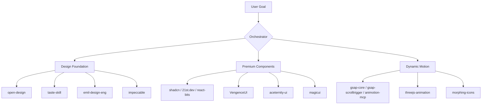

# Universal Frontend & UI Orchestrator Skill

This skill governs the execution of premium front-end, UI design, and animation workflows. Instead of selecting a single tool or framework, you must combine the strengths of all available UI capabilities to deliver visual excellence.

---

## 🎨 Core Design Philosophies

### 1. Zero Placeholders & Slop-Free Quality
- Never use generic or flat colors (e.g., standard red, blue, green). Utilize HSL curated palettes and smooth gradients.
- Typography: Always import professional fonts (e.g., Inter, Outfit, Syne, Roboto) via Google Fonts. Never rely on system defaults.
- Do not use text placeholders (like "Lorem Ipsum"). Write contextual, high-converting copywriting.

### 2. Multi-Skill Collaboration
For any front-end or UI task, you must combine the following domains:

---

## 🛠️ Step-by-Step Orchestration Guide

### Step 1: Initial Design Foundation (open-design first)
1. **Load Capabilities**: `open-design` (which must be used to generate the initial layout and styling foundation), and `frontend-design` (whose agent prompt guidelines must be strictly followed).
2. **Setup Variables**: Initialize `index.css` with HSL variables (supporting light/dark mode, semantic tokens, and smooth transitions).
3. **Load Training Data**: Verify that Graphify has retrieved the design system guidelines from `awesome-design-md` (such as Stripe, Linear, Vercel, Apple) based on the user's brief, and incorporate those specific design tokens, layout styles, and palettes.

### Step 2: Assemble Components & Layout
1. **Load Capabilities**: `shadcn`, `21st.dev`, `aceternity-ui`, `VengenceUI`, `react-bits`, `magicui`.
2. **Build Layout**: Assemble using semantic HTML5 tags (`<main>`, `<section>`, `<nav>`, `<footer>`).
3. **Premium Details**: Implement interactive UI cards with glassmorphism, card border gradients, and hover effects.
4. **Animate All Components**: Ensure all components feature appropriate transitions and animations (such as entrance, exit, scroll-triggered reveals, interactive hover/active states, and ambient micro-animations) using `gsap-core`, `gsap-scrolltrigger`, `gsap-timeline`, `threejs-animation`, `morphing-icons`, or `animotion-mcp`.

### Step 3: Further Refinement & Code Validation
1. **Load Capabilities**: All other secondary skills and MCP tools (like debug-skill, mapcn, canvas-design).
2. **Refine layout & structure**: Perform adjustments to CSS specificities, typography spacing, and code safety. Run debugging passes to verify compiler/runtime integrity.

### Step 4: Final Premium Polish (Taste & Impeccable at the end)
1. **Load Capabilities**: `taste-skill` and `impeccable` (which must specifically be executed at the end of the design/assembly sequence to polish the visual outcome).
2. **Color & Styling Polish**:
   - **Dark Mode Check**: If using a dark background, never use rainbow colors/gradients. Use bold, clean, premium colors.
   - **Glow Effect Check**: Avoid excessive glow effects. Keep all shadows, border glows, and light streaks extremely subtle and clean to maintain a premium feel.

### Step 5: Visual Quality Check (Playwright-MCP) & Self-Critique
1. **Load Capabilities**: `playwright-mcp`.
2. **Visual Review**: Run playwright tests to capture screenshots, inspect layout alignment, color variables, typographic harmony, and ensure it does not look like AI slop.
3. **Critique Pass**: Self-critique the design for zero placeholders, animation fluidity, color contrast, and premium aesthetic polish.

---

## ⚙️ Orchestration Checklist

- [ ] Does the UI feel premium? (Glassmorphism, custom scrollbars, curated color variables).
- [ ] Is typography imported and matching the brand voice?
- [ ] Are animations smooth (60fps) and using transform properties rather than layout triggers?
- [ ] Do elements have hover states, transitions, and active states?
- [ ] Is the design responsive and mobile-friendly?
- [ ] Have you indexed the completed task and relationships in `Graphify`?
