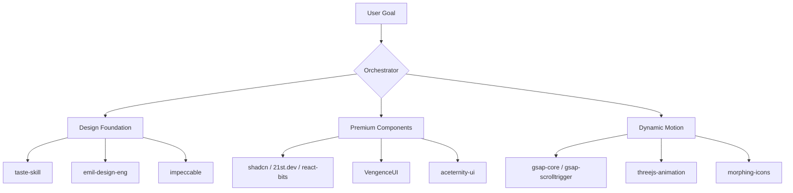

# Universal Frontend & UI Orchestrator Skill

This skill governs the execution of premium front-end, UI design, and animation workflows. Instead of selecting a single tool or framework, you must combine the strengths of all available UI capabilities to deliver visual excellence.

---

## 🎨 Core Design Philosophies

### 1. Zero Placeholders & Slop-Free Quality
- Never use generic or flat colors (e.g., standard red, blue, green). Utilize HSL curated palettes and smooth gradients.
- Typography: Always import professional fonts (e.g., Inter, Outfit, Syne, Roboto) via Google Fonts. Never rely on system defaults.
- Do not use text placeholders (like "Lorem Ipsum"). Write contextual, high-converting copywriting.

### 2. Multi-Skill Collaboration
For any front-end or UI task, you must combine the following domains:

---

## 🛠️ Step-by-Step Orchestration Guide

### Step 1: Initialize the Design System & Foundation
1. **Load Capabilities**: `frontend-design`, `taste-skill`, `impeccable`, `emil-design-eng`.
2. **Setup Variables**: Initialize `index.css` with HSL variables (supporting light/dark mode, semantic tokens, and smooth transitions).
3. **Typography & Layout**: Standardize spacing and typographic scale.

### Step 2: Assemble Components & Layout
1. **Load Capabilities**: `shadcn`, `21st.dev`, `aceternity-ui`, `VengenceUI`, `react-bits`.
2. **Build Layout**: Assemble using semantic HTML5 tags (`<main>`, `<section>`, `<nav>`, `<footer>`).
3. **Premium Details**: Implement interactive UI cards with glassmorphism, card border gradients, and hover effects.

### Step 3: Implement Dynamic Motion
1. **Load Capabilities**: `gsap-core`, `gsap-scrolltrigger`, `gsap-timeline`, `threejs-animation`, `morphing-icons`.
2. **Entrance Animations**: Use GSAP to animate hero elements on load with staggers.
3. **Scroll Animations**: Bind layouts to `ScrollTrigger` for smooth parallax, scroll-reveals, and pinned sections.
4. **Micro-interactions**: Use `morphing-icons` for state transitions (e.g., play/pause, menu open/close).

---

## ⚙️ Orchestration Checklist

- [ ] Does the UI feel premium? (Glassmorphism, custom scrollbars, curated color variables).
- [ ] Is typography imported and matching the brand voice?
- [ ] Are animations smooth (60fps) and using transform properties rather than layout triggers?
- [ ] Do elements have hover states, transitions, and active states?
- [ ] Is the design responsive and mobile-friendly?
- [ ] Have you indexed the completed task and relationships in `Graphify`?
